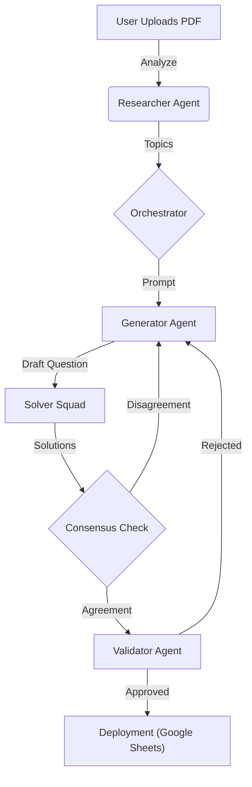

# 🧠 Team DeepMinds: Autonomous Aptitude Generator

[](https://www.python.org/)
[](https://streamlit.io/)
[](https://deepmind.google/technologies/gemini/)
[](LICENSE)

> **An autonomous agentic system for generating, validating, and deploying high-quality quantitative aptitude questions at scale.**

---

## 📺 Demo Video


---

## 🚀 Overview

**Quant Solver** is a sophisticated AI-powered pipeline designed to automate the creation of educational content. It employs a multi-agent architecture where specialized agents collaborate to:

1.  **🕵️ Research:** Analyze textbooks or PDFs to identify key topics and patterns.
2.  **✍️ Generate:** Create novel, non-duplicate aptitude questions.
3.  **🧮 Solve:** Use a "Solver Squad" to independently solve questions to ensure solvability.
4.  **⚖️ Validate:** Rigorously check for hallucinations, ambiguity, and correctness.
5.  **🚀 Deploy:** Automatically push verified content to a live database (Google Sheets).

## ✨ Key Features

-   **Autonomous Research**: Upload any PDF or use embedded context; the Researcher Agent extracts topics and difficulty levels automatically.
-   **Adversarial Validation**: Questions are only approved if multiple independent solver agents agree on the answer (Consensus Mechanism).
-   **Hallucination Detection**: Strict validation logic filters out broken or nonsensical questions.
-   **Live Dashboard**: A beautiful Streamlit UI to monitor the generation process, view success rates, and analyze topic heatmaps.
-   **Duplicate Prevention**: Uses hashing to ensure every generated question is unique.

## 🛠️ Tech Stack

-   **Frontend**: [Streamlit](https://streamlit.io/)
-   **AI Core**: [Google Gemini Pro](https://ai.google.dev/)
-   **Orchestration**: Custom Python Agentic Workflow
-   **Deployment**: Google Apps Script (Webhooks)
-   **Visualization**: Plotly / Matplotlib

## 📂 Project Structure

```bash
Quant_solver-main/
├── app.py                 # 🖥️ Main Streamlit Dashboard entry point
├── orchestrator.py        # 🎮 Central logic managing agent interactions
├── researcher.py          # 🕵️ Agent for analyzing content & extracting topics
├── solvers.py             # 🧮 Solver Squad (Multiple AI solvers)
├── validator.py           # ⚖️ Strict logic for answer verification
├── heatmap_viz.py         # 📊 Visualization tools for topic coverage
├── check_models.py        # 🛠️ Utility to check available AI models
└── test_deployment.py     # 🧪 Script to test deployment webhooks
```

## ⚡ Getting Started

### Prerequisites

-   Python 3.10 or higher
-   A Google Gemini API Key

### Installation

1.  **Clone the repository**
    ```bash
    git clone https://github.com/yourusername/Quant_solver.git
    cd Quant_solver
    ```

2.  **Install dependencies**
    ```bash
    pip install -r requirements.txt
    ```

3.  **Configure API Key**
    -   Open `orchestrator.py` (or set up an `.env` file).
    -   Add your Google Gemini API Key:
        ```python
        API_KEY = "YOUR_GEMINI_API_KEY"
        ```

### Running the Application

Launch the dashboard using Streamlit:

```bash
streamlit run app.py
```

## 📊 Workflow Visualization



## 🤝 Contributing

Contributions are welcome! Please feel free to submit a Pull Request.

1.  Fork the Project
2.  Create your Feature Branch (`git checkout -b feature/AmazingFeature`)
3.  Commit your Changes (`git commit -m 'Add some AmazingFeature'`)
4.  Push to the Branch (`git push origin feature/AmazingFeature`)
5.  Open a Pull Request

## 📄 License

Distributed under the MIT License. See `LICENSE` for more information.
