# 🧠 Team DeepMinds: Autonomous Aptitude Generator

[](https://www.python.org/)
[](https://streamlit.io/)
[](https://deepmind.google/technologies/gemini/)
[](LICENSE)

> **An autonomous agentic system for generating, validating, and deploying high-quality quantitative aptitude questions at scale.**

---

## 📺 Demo Video


---

## 🚀 Overview

**Quant Solver** is a sophisticated AI-powered pipeline designed to automate the creation of educational content. It employs a multi-agent architecture where specialized agents collaborate to:

1.  **🕵️ Research:** Analyze textbooks or PDFs to identify key topics and patterns.
2.  **✍️ Generate:** Create novel, non-duplicate aptitude questions.
3.  **🧮 Solve:** Use a "Solver Squad" of 3 parallel agents to independently solve questions.
4.  **⚖️ Validate:** Rigorously check for hallucinations, ambiguity, and correctness via consensus.
5.  **🚀 Deploy:** Automatically push verified content to a live database (Google Sheets).

---

## 🤖 Solver Squad: Parallel Agent Architecture

The **Solver Squad** is the heart of our validation system. It consists of **3 specialized AI agents** that run **in parallel** using Python's `ThreadPoolExecutor` for maximum efficiency:

| Agent | Role | Methodology |
|-------|------|-------------|
| **🐍 Agent A: Python Engineer** | Computational Solver | Writes and executes Python code to calculate the answer. Extracts the core algebraic equation used. |
| **🧠 Agent B: Logician** | Step-by-Step Reasoner | Solves using pure logical deduction without code. Provides detailed step-by-step explanations. |
| **⚔️ Agent C: Adversary** | Edge-Case Hunter | Actively looks for flaws, edge cases, or ambiguities. Uses alternative methods to verify. |

### 🔄 How Parallel Execution Works

```python
# From orchestrator.py - Concurrent solving with ThreadPoolExecutor
with concurrent.futures.ThreadPoolExecutor() as executor:
    future_a = executor.submit(self.squad.solve_with_code, question)    # Agent A
    future_b = executor.submit(self.squad.solve_with_logic, question)   # Agent B
    future_c = executor.submit(self.squad.solve_with_skeptic, question) # Agent C
    
    ans_a, ans_b, ans_c = future_a.result(), future_b.result(), future_c.result()
```

**Benefits of Parallel Execution:**
- ⚡ **3x Faster**: All agents solve simultaneously instead of sequentially
- 🎯 **Independent Verification**: No agent influences another's solution
- 🛡️ **Robust Consensus**: Agreement from diverse methods = high confidence

### ✅ Consensus Validation

A question is only approved if **all three agents agree** on the final answer. This multi-agent consensus mechanism ensures:
- Questions are **solvable** (not broken or ambiguous)
- The provided answer is **correct**
- The problem has a **single, unambiguous solution**

---

## ✨ Key Features

-   **🔀 Parallel Agent Execution**: 3 solver agents run concurrently using `ThreadPoolExecutor` for 3x faster validation.
-   **🤝 Multi-Agent Consensus**: Questions only pass when Python, Logic, and Adversarial agents all agree.
-   **🕵️ Autonomous Research**: Upload any PDF; the Researcher Agent auto-extracts topics and difficulty levels.
-   **🚫 Hallucination Detection**: Strict validation filters malformed or unsolvable questions.
-   **📊 Live Dashboard**: Real-time Streamlit UI with success rates, topic heatmaps, and generation stats.
-   **🔐 Duplicate Prevention**: MD5 hashing ensures every generated question is unique.

---

## 🛠️ Tech Stack

| Component | Technology |
|-----------|------------|
| **Frontend** | [Streamlit](https://streamlit.io/) |
| **AI Core** | [Google Gemini Pro](https://ai.google.dev/) |
| **Parallel Processing** | Python `concurrent.futures.ThreadPoolExecutor` |
| **Orchestration** | Custom Python Agentic Workflow |
| **Deployment** | Google Apps Script (Webhooks) |
| **Visualization** | Plotly / Matplotlib |

---

## 📂 Project Structure

```bash
Quant_solver-main/
├── app.py                 # 🖥️ Main Streamlit Dashboard entry point
├── orchestrator.py        # 🎮 Central logic + parallel agent coordination
├── researcher.py          # 🕵️ Agent for analyzing content & extracting topics
├── solvers.py             # 🧮 Solver Squad (3 parallel AI solvers)
├── validator.py           # ⚖️ Consensus validation logic
├── heatmap_viz.py         # 📊 Visualization tools for topic coverage
├── check_models.py        # 🛠️ Utility to check available AI models
└── test_deployment.py     # 🧪 Script to test deployment webhooks
```

---

## ⚡ Getting Started

### Prerequisites

-   Python 3.10 or higher
-   A Google Gemini API Key

### Installation

1.  **Clone the repository**
    ```bash
    git clone https://github.com/yourusername/Quant_solver.git
    cd Quant_solver
    ```

2.  **Install dependencies**
    ```bash
    pip install -r requirements.txt
    ```

3.  **Configure API Key**
    -   Open `orchestrator.py` (or set up an `.env` file).
    -   Add your Google Gemini API Key:
        ```python
        API_KEY = "YOUR_GEMINI_API_KEY"
        ```

### Running the Application

Launch the dashboard using Streamlit:

```bash
streamlit run app.py
```

---

## 📊 Workflow Visualization

```mermaid
flowchart TD
    subgraph Input
        A[📄 User Uploads PDF]
    end

    subgraph Research Phase
        A -->|Analyze| B[🕵️ Researcher Agent]
        B -->|Extract Topics & Patterns| C[📋 Topic Database]
    end

    subgraph Generation Phase
        C --> D{🎮 Orchestrator}
        D -->|Random Topic Selection| E[✍️ Generator Agent]
        E -->|Draft Question + Options| F[📝 Question Payload]
    end

    subgraph Parallel Solving Phase
        F --> G[🔄 ThreadPoolExecutor]
        G -->|Parallel| H[🐍 Agent A: Python Engineer]
        G -->|Parallel| I[🧠 Agent B: Logician]
        G -->|Parallel| J[⚔️ Agent C: Adversary]
        H --> K[Answer A]
        I --> L[Answer B]
        J --> M[Answer C]
    end

    subgraph Validation Phase
        K --> N{⚖️ Consensus Check}
        L --> N
        M --> N
        N -->|✅ All Agree| O[✔️ Validator Agent]
        N -->|❌ Disagreement| E
        O -->|Approved| P[🚀 Deploy to Google Sheets]
        O -->|Rejected| E
    end

    style G fill:#4CAF50,color:#fff
    style H fill:#2196F3,color:#fff
    style I fill:#9C27B0,color:#fff
    style J fill:#F44336,color:#fff
    style N fill:#FF9800,color:#fff
```



## 🤝 Contributing

Contributions are welcome! Please feel free to submit a Pull Request.

1.  Fork the Project
2.  Create your Feature Branch (`git checkout -b feature/AmazingFeature`)
3.  Commit your Changes (`git commit -m 'Add some AmazingFeature'`)
4.  Push to the Branch (`git push origin feature/AmazingFeature`)
5.  Open a Pull Request

## 📄 License

Distributed under the MIT License. See `LICENSE` for more information.
